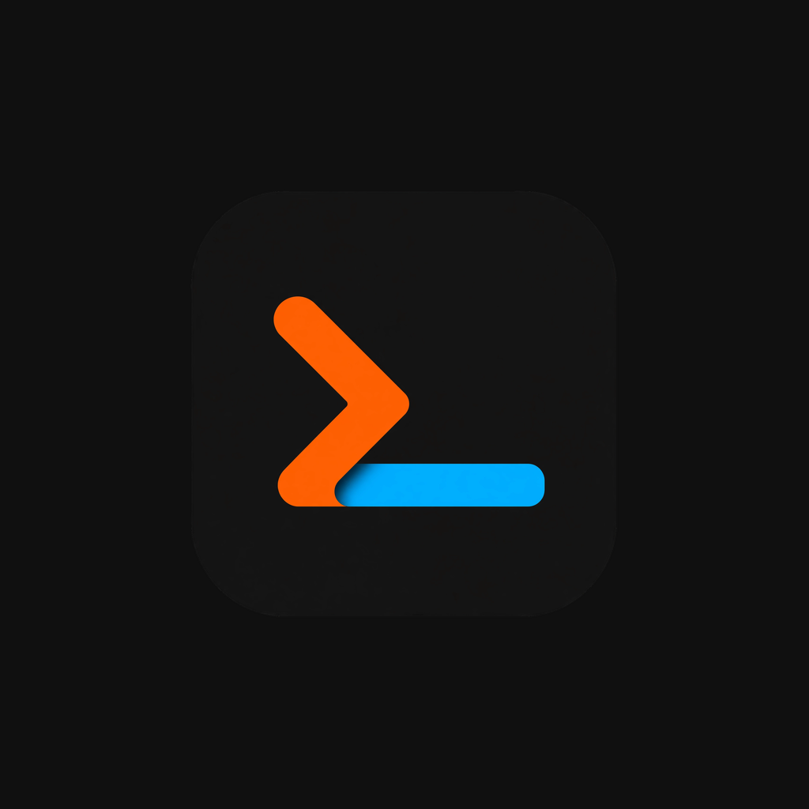

  

<h1 align="center">Relay</h1>

  
  
  
  

  Made by
  
  <a href="https://beecode.rs"><strong>Beecode</strong></a>

A small Expo (React Native) app for Android and iOS with a built-in SSH terminal: manage a list of servers, connect over SSH, and drive a remote shell (e.g. Claude Code in tmux) from your phone. It does four things:

- **Servers**: manage any number of SSH servers (host, port, username) with password or private-key auth; secrets stay in the device secure store, host keys are verified TOFU-style on first connect, and the form has a one-shot **Test Connection** with host-key accept/reject.
- **Terminal**: an interactive `xterm-256color` PTY shell with an extra keys row (ESC/TAB/CTRL/ALT/arrows), hidden-keyboard input, live PTY resize, an adjustable font size (also driven by the volume keys), and a dedicated landscape layout.
- **tmux**: a sessions drawer to switch, create, detach, and rename sessions, so long-running remote programs survive disconnects.
- **Settings**: light/dark/system theming plus terminal preferences.

## Status: Early Development

Relay is in early development and is not on Google Play or the App Store — packaged releases are published on the [GitHub Releases](https://github.com/beecode-rs/relay/releases) page (see [Download & install](#download--install)), and you can always build from source. It was built through rapid AI-assisted iteration rather than carefully reviewed engineering, so expect rough edges, missing pieces, and breaking changes without notice.

## Screenshots

<table>
  <tr>
    <td></td>
    <td></td>
    <td></td>
    <td></td>
    <td></td>
  </tr>
  <tr>
    <td align="center">Terminal</td>
    <td align="center">tmux sessions</td>
    <td align="center">Extra keys row</td>
    <td align="center">Function keys row</td>
    <td align="center">Text selection</td>
  </tr>
</table>

## Download & install

Grab the latest artifacts from the [GitHub Releases](https://github.com/beecode-rs/relay/releases/latest) page. Every `v*` tag produces one Android APK and one iOS IPA.

### Android

1. Download the `Relay-v<version>-android.apk` asset.
2. Allow installing unknown apps for your browser or file manager (Settings → Apps → Special access → Install unknown apps), then open the APK and confirm the install. Or install over USB: `adb install Relay-v<version>-android.apk`.
3. To update, just install a newer APK over the old one — releases are signed with the same key.

### iOS

The `Relay-v<version>-ios-unsigned.ipa` asset is **unsigned** (no Apple Developer account is involved), so it gets signed with your own Apple ID at install time by a sideload tool:

- **[AltStore](https://altstore.io)**: add the IPA through AltStore (or AltServer) with your Apple ID.
- **[Sideloadly](https://sideloadly.io)**: drag the IPA in, sign with your Apple ID, install over USB.
- On devices with **TrollStore**, the unsigned IPA can be installed directly and permanently.

Caveats: with a free Apple ID the signature lasts 7 days (re-sideload to refresh) and counts against the 3-active-apps limit. Sideloading re-signs the app and drops its keychain-access-group entitlement, so server secrets stay in the app's own keychain — expect to re-enter credentials after a reinstall even if you restored them from a backup that relied on the shared group.

## How SSH Works

SSH runs entirely in the JS runtime — there is no native SSH code. The app uses the pure-JS [`ssh2`](https://www.npmjs.com/package/ssh2) client (a setup ported from the `turnstone` project):

- `react-native-tcp-socket` provides raw TCP (Metro maps Node's `net` to it).
- `react-native-quick-crypto` provides Node-style `crypto`.
- `metro.config.js` swaps Node builtins (`fs`, `http`, `zlib`, …) for RN-safe stubs, replaces ssh2's WASM Poly1305 with a pure-BigInt implementation (`src/lib/ssh2-poly1305.ts`), and rewrites the quick-crypto entry point for Hermes.
- `src/app-boot/boot.ts` installs `Buffer`, `process`, and `TextEncoder`/`TextDecoder` globals with Node-compat Buffer patches (imported from `src/app/_layout.tsx`).
- `src/services/ssh/ssh2-shell-client.ts` opens an interactive `xterm-256color` PTY shell and implements the app's `SshTerminalPort` contract, including TOFU host-key verification (`SHA256:` fingerprints, known_hosts-format lines).

Because `react-native-tcp-socket` and `react-native-quick-crypto` are native modules, the app requires a **development build** (`pnpm ios` / `pnpm android`) — it cannot run in Expo Go.

## Feature Status

Done:

- [x] Server management (multiple servers, password or key auth, persisted; legacy single-profile migration)
- [x] One-shot Test Connection in the server form, with host-key accept/reject
- [x] SSH connection with TOFU host-key verification (SHA256 fingerprints, known_hosts-format lines)
- [x] Interactive xterm-256color PTY terminal
- [x] Extra keys row (ESC/TAB/CTRL/ALT/arrows) and hidden-keyboard input
- [x] PTY resize, with the terminal padded above the keyboard
- [x] Keyboard-aware server form (stays reachable above the keyboard)
- [x] tmux sessions drawer (switch, create, detach, rename)
- [x] Themed UI (light/dark/system) with settings and about screens
- [x] Terminal font size setting, adjustable with the volume keys
- [x] Landscape terminal layout
- [x] Clean disconnect from the terminal's close action
- [x] When we write the exit command in detached terminal session and exit the terminal, close the terminal screen and go back to server screen, currently it just restarts the session. it should stay disconnected.

TODO

## Security

Passwords, private keys, and accepted host keys stay on the device, stored in the OS secure store (`expo-secure-store`), and are sent only to the server they belong to; credentials and known hosts are kept per profile, and leaving the secret fields blank while editing keeps the stored values. The app has no analytics or telemetry dependencies.

## Development

Requires [Node.js](https://nodejs.org) and [pnpm](https://pnpm.io). Setup, the web SSH relay, and the automated quality gates are documented in [resource/docs/DEVELOPMENT.md](resource/docs/DEVELOPMENT.md).

## Releasing

Releases are tag-driven (`pnpm release:patch` / `release:minor` / `release:major` from `main`) and built by GitHub Actions — see [resource/docs/RELEASING.md](resource/docs/RELEASING.md), which also covers the one-time Android signing setup.

## Architecture

An Expo app layered as expo-router screen controllers in `src/app` over feature screens in `src/features`, business services (connection and profile stores, the SSH shell client, terminal preferences, theming) in `src/services`, and the ssh2 npm package isolated behind a single `SshTerminalPort`. The RN/Node compatibility layer that makes pure-JS ssh2 work — `src/lib`, `src/__internal__/polyfill-stubs/`, `src/app-boot/` — mirrors the proven turnstone setup; do not edit it casually.

## Contributing

Issues and pull requests are welcome. Keep the [feature status](#feature-status) in mind: the app is early in development, so check open issues before starting something large.

## License

[MIT](LICENSE)
