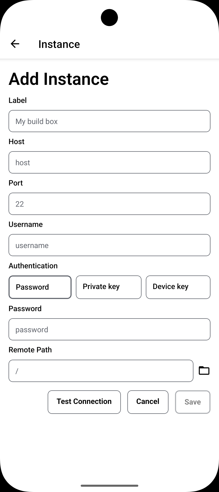
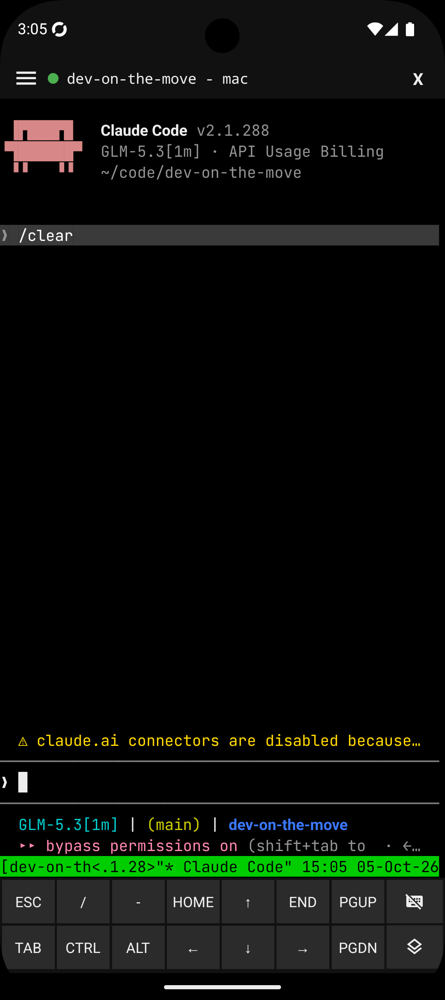
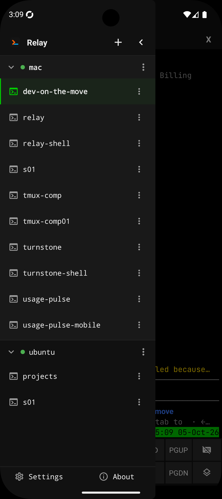
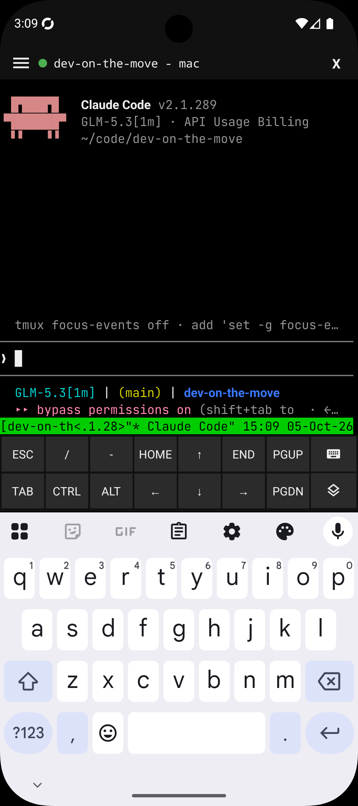
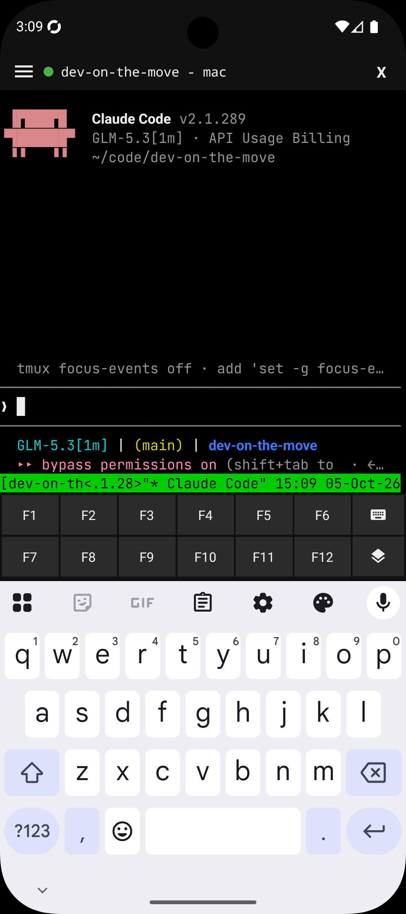
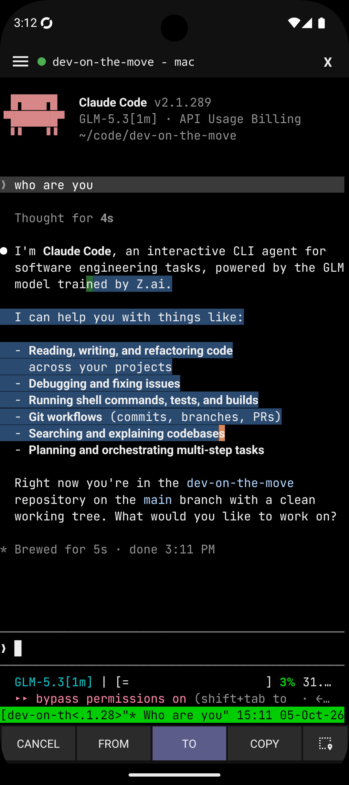

<p align="center">
  
</p>

<h1 align="center">Relay</h1>

<p align="center">
  
  
  
  
  
</p>

<p align="center">
  Made by
  <a href="https://beecode.rs"></a>
  <a href="https://beecode.rs"><strong>Beecode</strong></a>
</p>

Relay is a small Expo (React Native) app for Android and iOS with a built-in SSH terminal: manage a list of servers, connect over SSH, and drive a remote shell (e.g. Claude Code in tmux) from your phone. It does four things:

- **Servers** — manage any number of SSH servers with password, private-key, or device-key auth.
- **Terminal** — an interactive xterm-256color shell with an extra keys row and a landscape layout.
- **tmux** — a sessions drawer so long-running remote programs survive disconnects.
- **Settings** — theming, terminal preferences, and the device SSH key.

## Status: Proof of Concept

Relay is at **v0.2.1** and still a proof of concept. It was built through rapid AI-assisted iteration ("vibe coding") rather than carefully reviewed engineering, so expect rough edges, missing pieces, and breaking changes without notice. While it remains a POC the version stays on `0.x`; the move out of the POC phase coincides with the major version moving to `1`.

## Screenshots

| [Add server](resource/docs/features.md#servers) | [Terminal](resource/docs/features.md#terminal) | [tmux sessions](resource/docs/features.md#tmux-sessions) |
| :---: | :---: | :---: |
| <a href="resource/screenshots/add-new-instance.png"></a> | <a href="resource/screenshots/terminal-screen.png"></a> | <a href="resource/screenshots/side-menu-multi-sessions-multi-instances.png"></a> |

| [Extra keys row](resource/docs/features.md#terminal) | [Function keys row](resource/docs/features.md#terminal) | [Text selection](resource/docs/features.md#terminal) |
| :---: | :---: | :---: |
| <a href="resource/screenshots/keyboard-with-extra-keys.png"></a> | <a href="resource/screenshots/keyboard-with-function-keys.png"></a> | <a href="resource/screenshots/select-text-functionality.png"></a> |

The titles link to each feature's section in [resource/docs/features.md](resource/docs/features.md).

## Features

- **Servers** — manage any number of SSH servers (host, port, username) with password, private-key, or device-key auth.
- **Device SSH key** — the app generates an SSH key on the device and can install it on the server for you.
- **Test Connection** — a one-shot check in the server form, with host-key accept/reject.
- **Host keys (TOFU)** — verified trust-on-first-use on connect, with SHA256 fingerprints and known_hosts-format storage.
- **Terminal** — an interactive xterm-256color PTY shell with live resize and a dedicated landscape layout.
- **Extra keys row** — ESC, TAB, CTRL, ALT, and arrows, plus an F1–F12 layer, with hidden-keyboard input.
- **Text selection** — select text in the terminal, with optional selection-follows-finger.
- **Pinch to zoom** — adjust the terminal font size with a pinch, or pick a size in settings.
- **tmux sessions** — a drawer to switch, create, rename, clone, and delete sessions, so long-running remote programs survive disconnects.
- **Settings** — light/dark/system theming, terminal preferences, and device-key management (rename or regenerate).

For a deeper look at each feature — settings, edge cases, and how things work under the hood — see [resource/docs/features.md](resource/docs/features.md).

## Feature status

Done:

- [x] Server management (multiple servers, password, key, or device-key auth, persisted; legacy single-profile migration)
- [x] One-shot Test Connection in the server form, with host-key accept/reject
- [x] Device SSH key: generated on the device, installable onto a server from the server form, rename/regenerate in settings
- [x] SSH connection with TOFU host-key verification (SHA256 fingerprints, known_hosts-format lines)
- [x] Interactive xterm-256color PTY terminal
- [x] Extra keys row (ESC/TAB/CTRL/ALT/arrows, F1–F12) and hidden-keyboard input
- [x] PTY resize, with the terminal padded above the keyboard
- [x] Keyboard-aware server form (stays reachable above the keyboard)
- [x] tmux sessions drawer (switch, create, rename, clone, delete)
- [x] Themed UI (light/dark/system) with settings and about screens
- [x] Terminal font size setting, adjustable with pinch-to-zoom
- [x] Terminal text selection, with optional selection-follows-finger
- [x] Landscape terminal layout
- [x] Clean disconnect from the terminal's close action
- [x] Biometric lock for the app at startup (fingerprint / face unlock), off by default with a Settings → Security toggle

Planned:

- [ ] Typing `exit` in a detached terminal session should close the terminal screen and go back to the server screen — currently the session just restarts; it should stay disconnected.

## Download & install

Downloads live on the [GitHub Releases](https://github.com/beecode-rs/relay/releases) page.

### Android

1. Download the `Relay-v<version>-android.apk` asset.
2. Allow installing unknown apps for your browser or file manager (Settings → Apps → Special access → Install unknown apps), then open the APK and confirm the install. Or install over USB: `adb install Relay-v<version>-android.apk`.
3. To update, just install a newer APK over the old one — releases are signed with the same key.

### iOS

The `Relay-v<version>-ios-unsigned.ipa` asset is **unsigned** (no Apple Developer account is involved), so it gets signed with your own Apple ID at install time by a sideload tool:

- **[AltStore](https://altstore.io)**: add the IPA through AltStore (or AltServer) with your Apple ID.
- **[Sideloadly](https://sideloadly.io)**: drag the IPA in, sign with your Apple ID, install over USB.
- On devices with **TrollStore**, the unsigned IPA can be installed directly and permanently.

Caveats: with a free Apple ID the signature lasts 7 days (re-sideload to refresh) and counts against the 3-active-apps limit. Sideloading re-signs the app and drops its keychain-access-group entitlement, so server secrets stay in the app's own keychain — expect to re-enter credentials after a reinstall even if you restored them from a backup that relied on the shared group.

### From source

Requires [Node.js](https://nodejs.org) and [pnpm](https://pnpm.io).

```bash
git clone https://github.com/beecode-rs/relay.git
cd relay
pnpm install
pnpm android
```

Relay's SSH stack uses native modules, so it needs a development build on a device or emulator — it cannot run in Expo Go. The full development setup lives in [resource/docs/development.md](resource/docs/development.md).

## Getting started

1. Add a server: host, port, and username, with a password or a private key — or pick the device key, which Relay generates on the device and can install on the server for you.
2. Run the one-shot **Test Connection** from the server form and accept the server's host-key fingerprint when prompted.
3. Save the server and connect — you land in an interactive terminal on the remote shell.
4. Open the tmux drawer to create or switch sessions, so long-running remote programs survive disconnects.

## Privacy & security

**Passwords, private keys, and accepted host keys** stay on your device, stored in the OS secure store, and are sent only to the server they belong to. The app contains no analytics and no telemetry.

## Support & contributing

Found a bug or have an idea? Open an issue on [GitHub](https://github.com/beecode-rs/relay/issues) — include the app version, your OS, and the steps to reproduce. Pull requests are welcome too; keep the [feature status](#feature-status) in mind, and open an issue before starting something large.

## For developers

The README covers using the app. To work on it:

- [Development setup](resource/docs/development.md) — prerequisites, daily commands, quality gates
- [Architecture](resource/docs/architecture.md) — how the source is layered
- [Releasing](resource/docs/releasing.md) — tag-driven releases

## License

[MIT](LICENSE)
